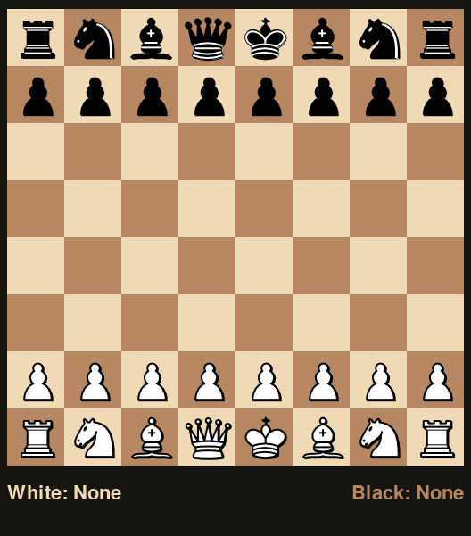
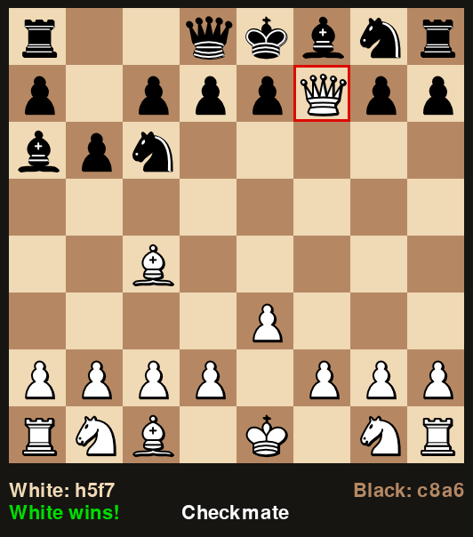

# Chess UI

This is a chess UI which uses `python-chess` and `pygame` to implement a working chess board.

[Python Chess](https://python-chess.readthedocs.io/en/latest/)

[Pygame](https://www.pygame.org/docs/)

## Move Generation

All the move generation code is in `main.py`. The opponent moves completely randomly with no skill and only a 
knowledge of which moves are legal. You will see that generating a random move with our library is very simple!

```python
def random_move_generator(board):
    moves = list(board.legal_moves)
    return random.choice(moves)
```

A `move generator` is essentially any function which accepts a `chess.Board` and returns a `chess.Move`.

## User Interface

I learned enough to make a basic chess interface which interfaces with our chess library.

### Example 1. Initial Position



### Example 2. Scholar's Mate



